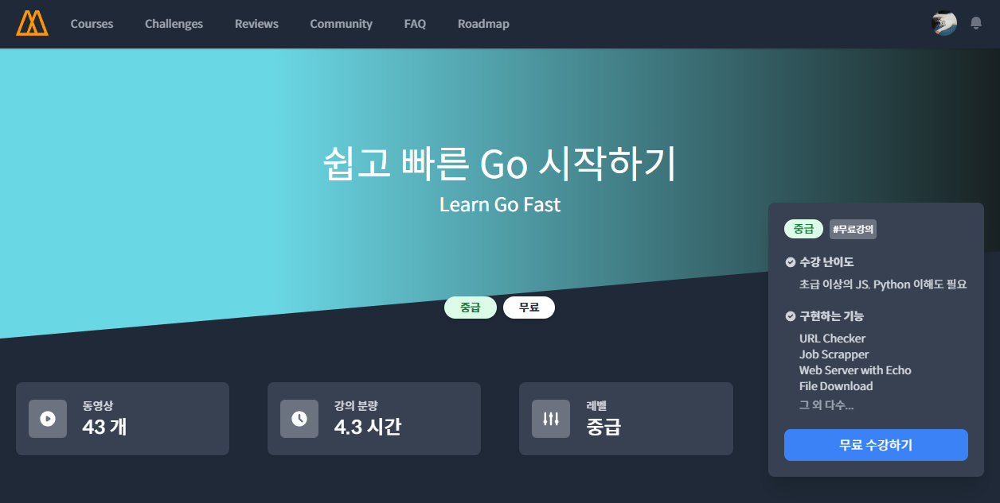

# 노마드코더 - 쉽고 빠른 Go 시작하기

[강의 링크](https://nomadcoders.co/go-for-beginners)

### 목적

Go로 서버 열고, 병렬화 배워보기 전에 Go 기초 다지기

### 학습 상태

- [X] #0 INTRODUCTION
- [ ] #1 THEORY
- [ ] #2 BANK & DICTIONARY PROJECTS
- [ ] #3 URL CHECKER & GO ROUTINES
- [ ] #4 JOB SCRAPPER
- [ ] #5 WEB SERVER WITH ECHO

### 학습 메모

학습 도중 새롭게 알게된 사실에 대해서 메모합니다.
