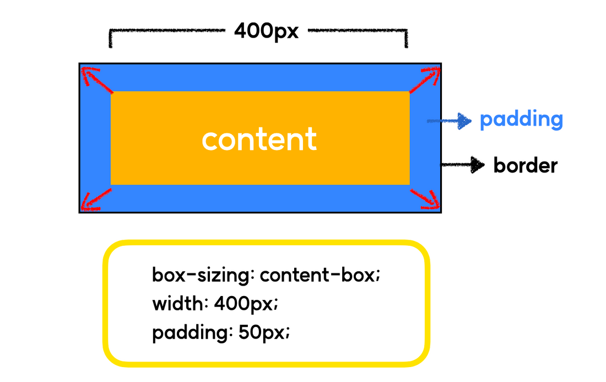
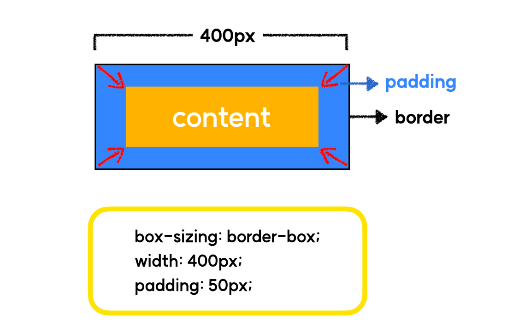
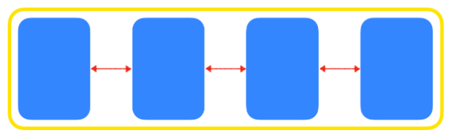
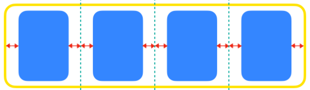
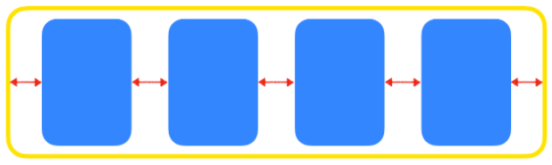
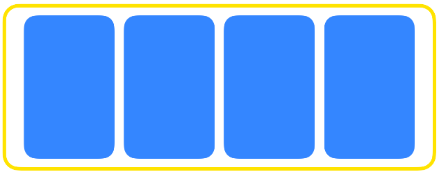

**Border 영역을 기준으로 box의 size를 적용합니다.**

# [인프런x코드캠프] 강력한 CSS

### 목적

css 부분에서 단순히 구글링(야매)로 해결하고 넘어갔던 부분를 제대로 익히기 (기초다지기)

### 학습 상태

- [x] 섹션 0. CSS 개요
- [ ] 섹션 1. 레이아웃 (float&flex)
- [ ] 섹션 2. 레이아웃 (flex2)
- [ ] 섹션 3. 폰트&단위
- [ ] 섹션 4. 배경&색상
- [ ] 섹션 5. position / transition
- [ ] 섹션 6. transform
- [ ] 섹션 7. animation
- [ ] 섹션 8. grid 레이아웃
- [ ] 섹션 9. 반응형 레이아웃

### 학습 메모

학습 도중 새롭게 알게된 사실이나 중요한 부분에 대해서 메모합니다.

**섹션 0. CSS 개요**

- 자손 선택자 : 공백으로 구분
- 다중 선택자 : 공백 없이 연속으로 붙임
- "box-sizing: content-box" : Content 영역을 기준으로 box의 size를 적용합니다. (기본값)

  

- "box-sizing: border-box" : Border 영역을 기준으로 box의 size를 적용합니다. (일반적으로 모든 오브젝트에 border-box로 수정해줌)

  

- "display: block" : 블록 요소를 여러개 연속해서 쌓을 경우 자동으로 다음 줄로 넘어간다. 좌우 양 쪽으로 늘어나 부모 요소의 너비를 가득 채운다.
- "display: inline" : 여러개의 요소를 연속해서 입력해도 자동으로 다음 줄로 넘어가지 않는다. 태그에 할당된 공간 만큼의 너비만 차지한다.
- inline 요소에는 width 등의 크기가 지정되지 않음

**섹션 1. 레이아웃 (float & flex)**

- 가상클래스 선택자 : 선택자 뒤에 :가상 이벤트 를 붙이면 특정 이벤트마다 적용 할 스타일을 설정 할 수 있으며, 이를 가상 클래스라고 한다.
  - `:first-child` : 첫번째 자식
  - `:last-child` : 마지막 자식
  - `:nth-child(3)` : 3번째 자식
  - `:nth-child(2n)` : 2의 배수번째 자식
  - `:nth-child(2n - 1)` : 홀수번째 자식
  - `:nth-child(3n)` : 3의 배수번째 자식
  - `:hover` : 마우스를 요소에 올렸을 때
- `과거에는 float를 사용`해서 레이아웃을 구성하였고, `이후에 flex가 등장`하며 flex를 보편적으로 사용하게 되었고 점차 float를 사용하지 않게되었습니다.
  `마지막으로 제일 나중에 grid가 등장`하였으며, 현대 웹에서는 `flex와 grid를 혼용`하는 추세이다.
- `float` : HTML 요소를 일반적인 흐름(normal flow)으로부터 벗어나서 특정한 컨테이너의 좌측 혹은 우측을 감싸는 형태로 강제 배치할 수 있도록 도와주는 속성입니다.
  - float: none (기본값)
  - float: left
  - float: right
- `clear` : float가 적용된 요소에 추가로 줄 수 있는 속성으로, float의 영향력을 해당 요소에 한해 해제한다.
  - clear: none (기본값)
  - clear: left
  - clear: right
  - clear: both
  - `float: right` 는 `clear: left`로는 영향력을 해제할 수 없음
- `calc()` : css 내부에서의 계산을 하는 함수
  - ex, `width: calc(100% - 200px);`
- flex-direction (배치 방향 설정)
  - `row` (행) : 중심축을 가로 방향으로 배치합니다.
  - `column` (열) : 중심축을 세로 방향으로 배치합니다.
- justify-content (메인축 방향 정렬)
  - 메인축은 flex-direction방향과 동일합니다.
  - 메인축 방향으로 어떻게 정렬할지 결정합니다.
  - `justify-content: flex-start` (기본값) : 왼쪽 정렬
  - `justify-content: center` (기본값) : 중앙 정렬
  - `justify-content: space-between` : 동일한 여백을 두고 정렬
    
  - `justify-content: space-around` : 동일한 여백을 두고 정렬
    
  - `justify-content: space-evenly` : 동일한 여백을 두고 정렬
    
- align-items (교차축 방향 정렬)
  - `align-items: stretch` : 위 아래로 쭉 늘려서 배치함
    
  - `align-items: flex-start` : 시작점에 맞춰 배치함
    
  - `align-items: flex-end` : 시작점에 맞춰 배치함
    
  - `align-items: center` : 중앙에 맞춰 배치함
    
